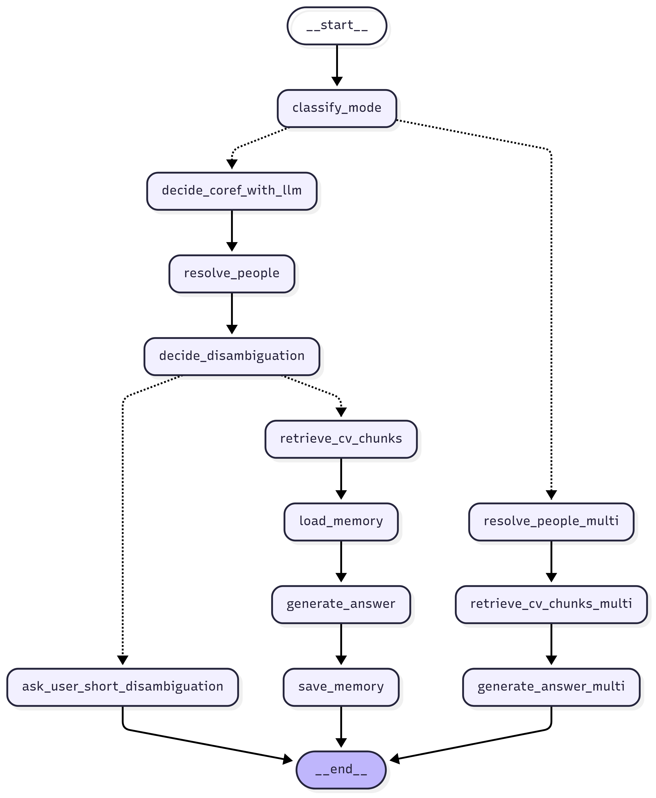
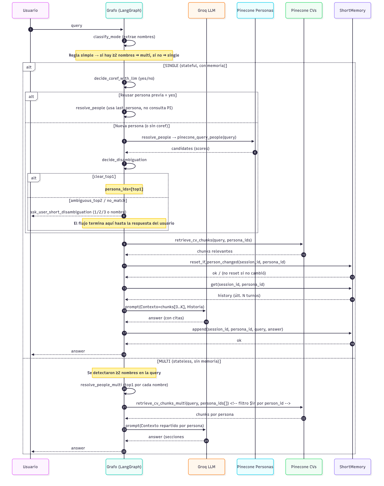

# CV Chatbot - RAG/Memory/Desambiguation/Multi-query

**Asistente para análisis de Currículums con arquitectura de agentes,
RAG y desambiguación por persona.**

Repo: https://github.com/joagonzalez/ceia-nlp-II-tp-3

**Características principales de la implementación:**

- **RAG sobre CVs**: combina consultas semánticas en Pinecone con generación de respuestas usando Groq LLM.  
- **Memoria corta por persona**: conserva hasta *N* turnos de contexto por `(session_id, persona_id)`, reseteándose automáticamente cuando cambia la persona en foco.  
- **Desambiguación de candidatos**: si una consulta coincide con múltiples personas, propone opciones (1/2/3) o permite elegir por nombre/ID.  
- **Coreference Handling**: un clasificador binario (LLM) decide si una pregunta se refiere a la misma persona previa o introduce una nueva.  
- **Índices especializados en Pinecone**:  
  - *People Index* → identifica candidatos por nombre.  
  - *CV Index* → recupera chunks relevantes de los CVs, con filtro server-side por `person_id`.  
- **Respuestas con contexto y citas**: las respuestas del agente incluyen bullets claros (Experiencia, Educación, Skills) y referencias `[ # ]`.  
- **Arquitectura basada en grafo (LangGraph)**: cada nodo representa un paso (coref, búsqueda, desambiguación, retrieval, generación, memoria), con control de flujo condicional basado en una clase de control de estados *AgentState*.

- **Soporte multi-persona**: si en la query se mencionan explícitamente dos o más nombres, el sistema deriva a un flujo paralelo que resuelve cada persona, recupera sus CVs y genera una respuesta comparativa en secciones separadas. En todos los demás casos se utiliza el flujo single-persona con coreferencia y memoria.



------------------------------------------------------------------------

## Consigna

Sobre el trabajo de la clase 6: implementar un sistema de **agentes**
para que responda de manera eficiente dependiendo de qué persona se está
preguntando (**1 agente por persona**).

**Entregables** - Link a **repo público**.
- **Captura de video** del chatbot consultando los CVs de los
integrantes del equipo.

**Importante** - Si la query **no nombra** a nadie, se utiliza **por
defecto el agente del alumno**.
- Si se consulta **más de un CV**, traer el contexto de cada uno y
responder acorde.
- El video debe mostrar todas estas funcionalidades.

**Link de entrega**
[Formulario de entrega](https://forms.gle/roAtRx2rXawaftjm7)

**Evaluación** - Se evaluará tanto el **código** como la
**presentación** (repo con documentación).

------------------------------------------------------------------------

## Arquitectura (alto nivel)

-   **Vector DB (RAG)**
    -   **Índice de Personas**: embeddings de *nombre y apellido*,
        metadata con `person_id`.
    -   **Índice de CVs**: *chunks* de texto del CV, embeddings por
        chunk, metadata con `person_id`, `chunk_id`, `section`,
        `company`, etc.
    -   La recuperación se hace con una función
        `search_similar(text, top_k, namespace, ...)` (text‑in → top‑k).
-   **Grafo de LangGraph**
    1.  **Clasificación de modo (single/multi)**: el sistema analiza la query inicial; si se detectan dos o más nombres explícitos, deriva al flujo multi, en caso contrario al flujo single.
    2.  **Coreferencia (LLM)**: en el modo single, un clasificador "yes/no" decide si la query actual sigue hablando de la **misma persona** del turno
        anterior.
    3.  **Resolver Persona**: si hay que cambiar/buscar, consulta el
        índice de personas y obtiene **candidatos**; si la decisión fue
        "reusar", fija la **última persona activa**.
    4.  **Desambiguación**: si hay empate o baja confianza, el asistente
        **repregunta** y el usuario responde con un **número** (1/2/3) o
        un **ID/nombre exacto**.
    5.  **RAG de CV**: recupera chunks **solo** de la persona elegida
        (`person_id`), arma el contexto y genera respuesta con citas.
    6.  **Memoria corta**: guarda hasta *N* turnos **por (sesión,
        persona)** para mejorar continuidad **sin contaminar** entre
        personas.
    7.  **Flujo multi-persona**: si se detectan múltiples nombres, se resuelven los top‑1 candidatos para cada uno, se recuperan sus chunks de CV y se genera una respuesta estructurada por secciones (una sección por persona).

-   **LLM (Groq)** para:
    -   Clasificación de coreferencia (sí/no).
    -   Clasificación de modo (single/multi).
    -   Extracción de nombres en la query.
    -   Generación de respuesta final condicionada al contexto
        recuperado.

------------------------------------------------------------------------

## Cómo clonar y usar el repositorio

```bash
git clone https://github.com/joagonzalez/ceia-nlp-II-tp-3
cd ceia-nlp-II-tp-3
```

### Comandos principales (Makefile)

```make
install:
	uv sync

ui:
	uv run ui.py
	
cli:
	uv run run.py $(ARGS)

plot:
	uv run plot.py
```

Ejecución típica:

```bash
# Instalar dependencias y crear el entorno
make install

# Iniciar la UI (Dash)
make ui

# Usar la CLI (agregar ARGS si corresponde, p. ej. "load-data")
make cli
```

------------------------------------------------------------------------

## Diagramas y vistas

**Diagrama de secuencia (flujo single/multi)**  


**Vista de la UI (Dash)**  
