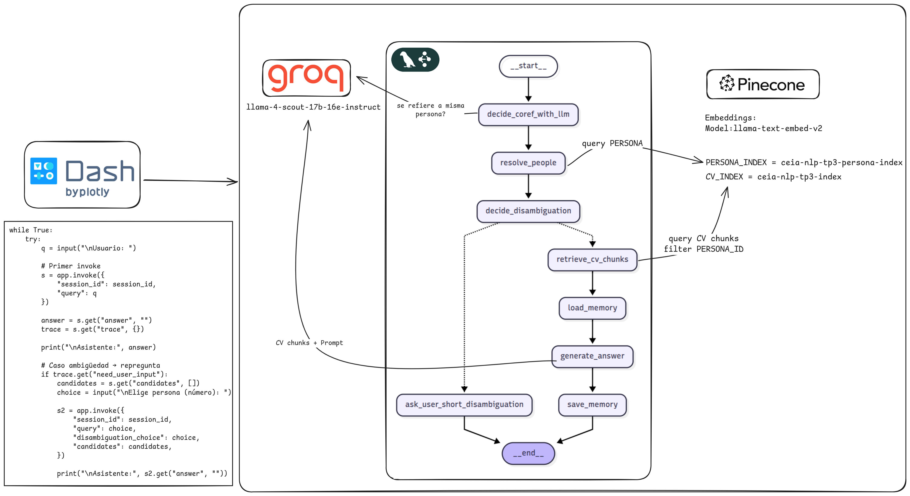

# Trabajo Práctico N°3 -- NLP2 (FIUBA)

**Asistente para análisis de Currículums con arquitectura de agentes,
RAG y desambiguación por persona.**

Repo: https://github.com/joagonzalez/ceia-nlp-II-tp-3




------------------------------------------------------------------------

## Consigna

Sobre el trabajo de la clase 6: implementar un sistema de **agentes**
para que responda de manera eficiente dependiendo de qué persona se está
preguntando (**1 agente por persona**).

**Entregables** - Link a **repo público**.
- **Captura de video** del chatbot consultando los CVs de los
integrantes del equipo.

**Importante** - Si la query **no nombra** a nadie, se utiliza **por
defecto el agente del alumno**.
- Si se consulta **más de un CV**, traer el contexto de cada uno y
responder acorde.
- El video debe mostrar todas estas funcionalidades.

**Link de entrega**
[Formulario de entrega](https://forms.gle/roAtRx2rXawaftjm7)

**Evaluación** - Se evaluará tanto el **código** como la
**presentación** (repo con documentación).

------------------------------------------------------------------------

## Arquitectura (alto nivel)

-   **Vector DB (RAG)**
    -   **Índice de Personas**: embeddings de *nombre y apellido*,
        metadata con `person_id`.
    -   **Índice de CVs**: *chunks* de texto del CV, embeddings por
        chunk, metadata con `person_id`, `chunk_id`, `section`,
        `company`, etc.
    -   La recuperación se hace con una función
        `search_similar(text, top_k, namespace, ...)` (text‑in → top‑k).
-   **Grafo de LangGraph**
    1.  **Coreferencia (LLM)**: clasificador "yes/no" decide si la query
        actual sigue hablando de la **misma persona** del turno
        anterior.
    2.  **Resolver Persona**: si hay que cambiar/buscar, consulta el
        índice de personas y obtiene **candidatos**; si la decisión fue
        "reusar", fija la **última persona activa**.
    3.  **Desambiguación**: si hay empate o baja confianza, el asistente
        **repregunta** y el usuario responde con un **número** (1/2/3) o
        un **ID/nombre exacto**.
    4.  **RAG de CV**: recupera chunks **solo** de la persona elegida
        (`person_id`), arma el contexto y genera respuesta con citas.
    5.  **Memoria corta**: guarda hasta *N* turnos **por (sesión,
        persona)** para mejorar continuidad **sin contaminar** entre
        personas.
-   **LLM (Groq)** para:
    -   Clasificación de coreferencia (sí/no).
    -   Generación de respuesta final condicionada al contexto
        recuperado.

------------------------------------------------------------------------

## Requisitos

-   Python 3.10+ (recomendado 3.11/3.12)
-   Dependencias en `requirements.txt`
-   Claves/config:
    -   `GROQ_API_KEY` y `GROQ_LLM_MODEL` (p. ej.
        `llama-3.1-70b-versatile`)
    -   `PINECONE_INDEX` (indice de CVs)
    -   `PINECONE_PERSONA_INDEX` (indice de personas)

Podés definirlas en `src/config/settings.py` o vía variables de entorno.

Ejemplo de `.env` (opcional):

``` bash
GROQ_API_KEY=...
GROQ_LLM_MODEL=llama-3.1-70b-versatile
```

------------------------------------------------------------------------

## Instalación
Se utiliza uv como gestor de dependencias y de virtual envs a traves del uso de un Makefile en la raíz del repositorio. Las dependencias se listan en **pyproject.toml** asi como metadata de la aplicación y parametría de linter (ruff) y static code analysis (mypy)

``` bash
git clone https://github.com/joagonzalez/ceia-nlp-II-tp-3
cd ceia-nlp-II-tp-3

make install
```

Configurar `src/config/settings.py` con tus claves y nombres de
índices/namespaces.

------------------------------------------------------------------------

## Cómo correr

### 1) Cargar datos en la Vector DB (RAG)

Este comando ejecuta la carga/actualización de índices (personas y CVs) utilizando el dataset de CVs que se encuentra en la carpeta **data/**:

``` bash
make cli ARGS="load-data"
```

> Si los índices ya están creados y cargados, se puede saltear este paso.

------------------------------------------------------------------------

### 2) CLI (consola interactiva)

``` bash
make cli
```

Ejemplos:

    Usuario: datos personales de Valentina
    Asistente: ...

    Usuario: me dirías sus últimas experiencias laborales?
    Asistente: ... (reutiliza Valentina si corresponde)

    Usuario: info de Camila
    Asistente: Encontré varias personas...
    1. Camila Herrera (id=...)
    2. Camila Rojas (id=...)
    3. Camila Pérez (id=...)
    Tu elección: 2
    Asistente: ... (responde sobre la #2)

> La CLI implementa el flujo: primer `invoke`, si hay `need_user_input`
> → guarda `candidates` y espera un **número**; luego segundo `invoke`
> con `disambiguation_choice` + `candidates`.

------------------------------------------------------------------------

### 3) UI (Dash)

``` bash
make ui
```

Abrí en el navegador: http://0.0.0.0:8050

-   Misma **lógica minimalista** que la CLI (un solo input).
-   Si hay desambiguación, el asistente **repregunta** y listará
    opciones. Escribí el **número** en el mismo input y presioná
    **Enviar**.

------------------------------------------------------------------------

## Cómo funciona (detalles clave)

### A) Recuperación semántica (RAG + Vector DB)

-   **Índice de Personas**
    Se consulta con el texto completo de la query (p. ej., "Camila dev
    exp", "datos de Valentina"). Se obtienen **candidatos** con campos:

    ``` json
    {
      "persona_id": "...",
      "name": "Nombre Apellido",
      "score": 0.42
    }
    ```

    Se deduplican por `persona_id` y se ordenan por `score`.

-   **Índice de CVs**
    Se consulta con la **pregunta actual**. Se trae un "oversample" y
    luego se **filtra client‑side** por `person_id` de los candidatos
    elegidos.
    El contexto final incluye `[id=chunk_id | section/company]` y texto
    del chunk.

-   **Respuesta del LLM**
    El *system prompt* fuerza a **responder solo con el contexto
    recuperado** y a **citar** con `[1] [2]` y una lista final de
    `(id=..., sección/empresa)`.

------------------------------------------------------------------------

### B) Desambiguación de persona

-   Umbrales:
    -   `MIN_SCORE`: score mínimo para aceptar un match.
    -   `AMBIG_DELTA`: diferencia mínima entre top‑1 y top‑2 para
        considerarlo "claro".
-   Casos:
    -   **Match claro** → se selecciona top‑1.
    -   **Ambigüedad** (top‑1 ~ top‑2) → **repregunta** y muestra
        opciones (1/2/3).
    -   **Elección del usuario**
        -   Si escribe **número** → se interpreta contra la **misma
            lista** de candidatos (se reinyecta en la 2ª vuelta para
            mantener el orden).
        -   Si pega **persona_id** o **nombre exacto** → se selecciona
            directo.

> Importante: en la **segunda invocación** no se vuelve a buscar; se
> usan los **candidates previos** para que "1/2/3" coincida con lo
> mostrado.

------------------------------------------------------------------------

### C) Coreferencia (¿sigue hablando de la misma persona?)

-   Nodo `decide_coref_with_llm`: una llamada a LLM que pide respuesta binaria (yes/no) determina si una query como "sus últimas experiencias" se refiere a la **misma     persona** del turno anterior.
-   Si **sí** → `resolve_people` **no** busca y fija la **última persona
    activa**.
-   Si **no** → se busca en el índice de personas y se desambigua si
    hace falta.

Esto mejora la UX sin regex frágiles y evita repreguntas innecesarias.

------------------------------------------------------------------------

### D) Memoria corta por persona (ShortMemory)

-   Clave: `(session_id, persona_id)`.
-   Guarda hasta **N turnos** (pares *usuario/asistente*).
-   Si cambia la persona, **resetea** los buffers de la sesión para
    evitar **contaminación**.
-   Se usa para enriquecer el prompt (coherencia y continuidad) **solo
    dentro** de la misma persona.

------------------------------------------------------------------------

## Estructura del repo

    data/                     # CVs utilizados para el trabajo
    src/
      agent.py                # Grafo LangGraph: coref LLM, resolver persona, desambiguar, RAG CV, memoria
      vectorService.py        # search_similar(text, top_k, namespace, ui=False) → hits con fields
      config/
        settings.py           # claves y nombres de índice/namespace, modelo Groq, umbrales, etc.
    ui.py                     # UI en Dash (misma lógica simple de la CLI)
    run.py                    # CLI: loop readline con primera y segunda invocación
    plot.py                   # Export diagrama mermaid del grafo de la app LanGraph
    Makefile                  # targets: cli, ui, load-data
    requirements.txt
    README.md

------------------------------------------------------------------------
